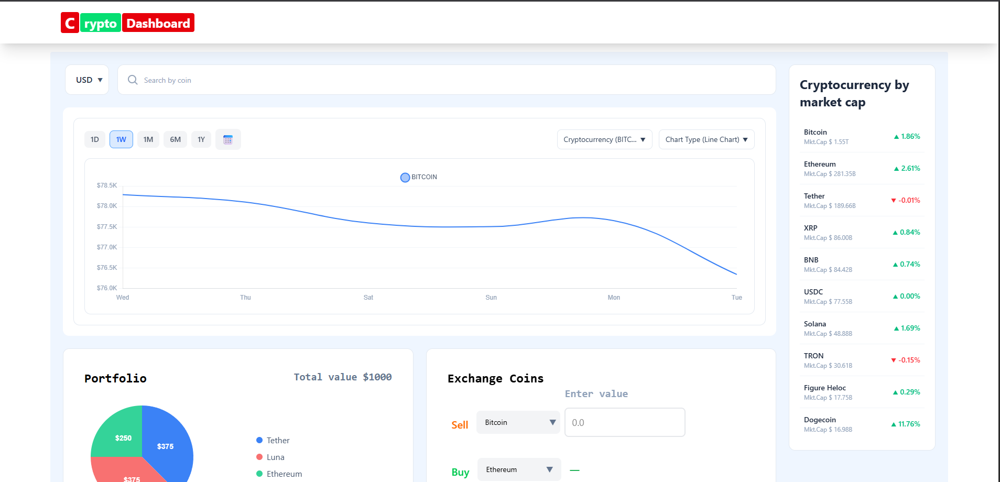
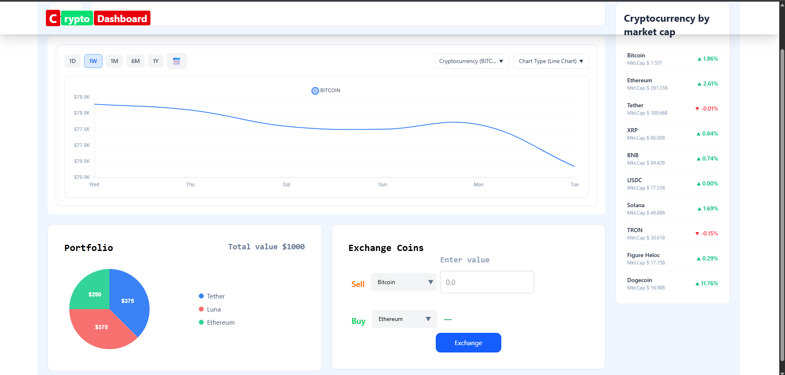

Crypto Dashboard

A modern, production-ready cryptocurrency dashboard built with **React(vite), Redux Toolkit, Chart.js, react-chartjs-2 and Tailwind CSS**.
It provides real-time market insights, interactive visualizations, and a seamless user experience for tracking and analyzing crypto assets.

---

🌐 Live Demo

🔗 https://crypto-dashboard-bay-five.vercel.app/

---

📸 Preview

### Dashboard Overview



---

✨ Key Features

📊 Market Intelligence

* Real-time cryptocurrency data using CoinGecko API
* Top assets ranked by market capitalization
* 24h price change indicators

📈 Advanced Charting

* Interactive **Line & Bar charts**
* Time filters: **1D, 1W, 1M, 6M, 1Y**
* Multi-coin comparison
* Smooth rendering with optimized datasets

💱 Exchange Module

* Convert between:

  * Crypto ↔ Crypto
  * Crypto ↔ Fiat (USD, INR, EUR)
* Real-time conversion logic
* Input validation & error handling

🥧 Portfolio Visualization

* Asset distribution using pie charts
* Value & percentage display
* Clean and intuitive layout

### 🔍 Smart Search & Selection

* Dynamic coin search
* Multi-select comparison system

---

## 🛠️ Tech Stack

```
Frontend: React.js(Vite bundler)
State Management: Redux Toolkit
Data Visualization: Chart.js, react-chartjs-2
Styling: Tailwind CSS
API: CoinGecko
```

---

⚙️ Getting Started

```bash
git clone https://github.com/Arunvarma29/Crypto_Dashboard.git
cd crypto-dashboard
npm install
npm run dev
```

---

📂 Project Structure

```
src/
├── components/     # Reusable UI components
├── features/       # Chart, Exchange, Portfolio modules
├── services/       # API abstraction layer
├── store/          # Redux slices
├── utils/          # Data formatting & helpers
```
---

⚡ Highlights

* Optimized API handling with fallback strategy to prevent UI flicker
* Scalable feature-based architecture
* Responsive design across devices
* Clean separation of concerns (UI, logic, data)

---

📄 License

MIT

---

👨‍💻 Author

Arun Varma

---

⭐ Support

If you find this project useful, consider giving it a ⭐
